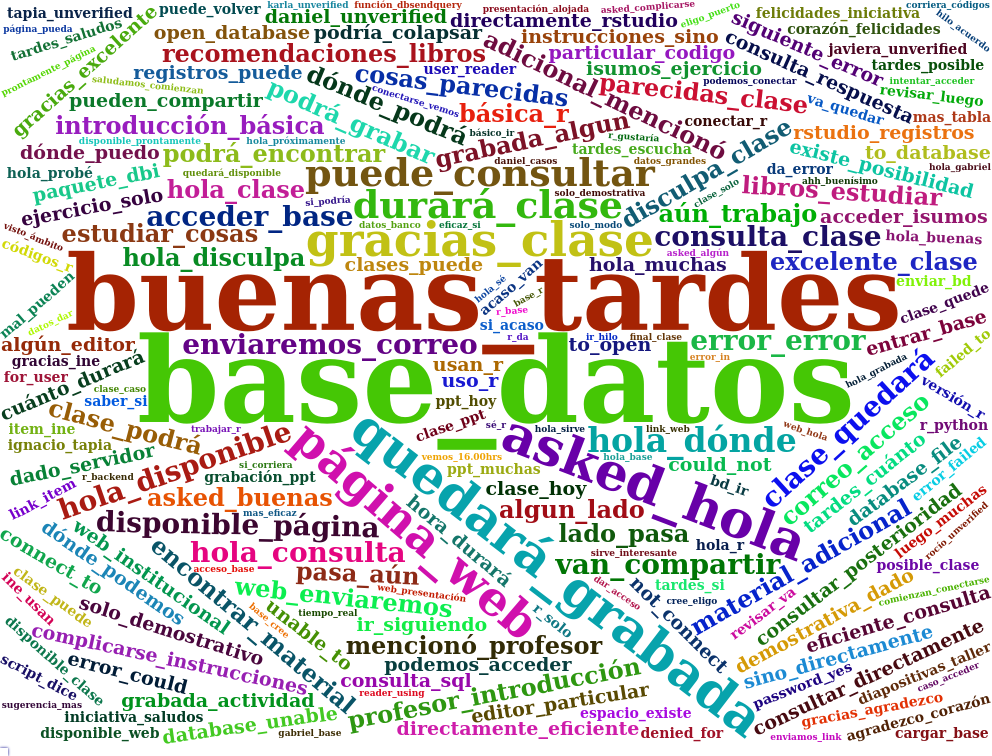

```{r setup, include=FALSE}
knitr::opts_chunk$set(echo = FALSE, warning = F, message = F)
```

```{r}
library(readr)
library(dplyr)
library(feather)
library(wordcloud2)
library(quanteda)
library(quanteda.textstats)
library(quanteda.textplots)
library(janitor)
library(stringr)
library(ggplot2)
library(purrr)
library(plotly)
library(lubridate)
library(htmlwidgets)
Sys.setenv("OPENSSL_CONF"="/dev/null")
```

# Reporte asistencia clase


### Interacciones en el chat

```{r preprocesamiento}
comments = read_csv("../data/Reporte_Preguntas.csv")
comments_edit <- comments %>% 
  clean_names() %>% 
  rename(text = content) %>% 
  mutate(date = str_sub(timestamp, 1, 9),
         date = as.POSIXct(date, format="%m/%d/%Y"),
         time = str_sub(timestamp, 11, 20),
         time =  as.POSIXct(time,format='%I:%M:%S %p'),
         time =  format(time, format = "%H:%M")) %>%
  mutate(time =   as.POSIXct(x = time, format = "%H:%M") -  (4*3600)) 


paradata <- read_csv("../data/Reporte_Asistentes.csv")

paradata2 <- paradata %>% 
  clean_names() %>% 
  filter(role == "Attendee") %>% 
  mutate(time = as.POSIXct(utc_event_timestamp, format='%m/%d/%Y %I:%M:%S %p')) %>%
  mutate(time =  time -  (4*3600)) %>% 
  filter(time >= as.POSIXct("2023-05-30", format="%Y-%m-%d")) %>% 
  mutate(time2 =  (hm(paste0(hour(time), ":", minute(time))))) %>% 
  mutate(user_agent = tolower(user_agent)) %>% 
  mutate(platform = case_when(
    str_detect(user_agent, "windows") ~ "windows",
    str_detect(user_agent, "iphone") ~ "iphone",
    str_detect(user_agent, "android") ~ "android",
    str_detect(user_agent, "macintosh") ~ "macintosh",
    str_detect(user_agent, "linux") ~ "linux",
    str_detect(user_agent, "ipad") ~ "ipad",
    str_detect(user_agent, "mozilla") ~ "mozilla"
  )) %>% 
  mutate(device = case_when(
    platform %in% c("windows", "macintosh", "linux", "mozilla")  ~ "computador",
    platform %in% c("iphone", "android") ~ "celular",
    platform %in% c("ipad") ~ "ipad"
  ))


```

```{r nube chat, eval=FALSE}

words <- corpus(comments_edit) %>% 
  tokens(remove_punct = TRUE, remove_numbers = TRUE) %>% 
  tokens_select(pattern = stopwords("es"), selection = "remove") %>% 
  tokens_ngrams(2) %>% 
  dfm() %>% 
  textstat_frequency(n = 1000) %>% 
  rename(word = feature,
         freq = frequency)

wc <- wordcloud2(words, size=1.1, color='random-dark')
saveWidget(wc, "tmp.html", selfcontained = F)
webshot("tmp.html", "wordcloud.png", delay = 7)


```




## Cantidad de preguntas por minuto en el chat

```{r}


plot_comments <-  comments_edit %>%
  group_by(time) %>% 
  summarise(comentarios = n()) %>% 
  mutate(time2 = format(time, format = "%H:%M")) %>% 
  ggplot(aes(x = time, y = comentarios, group = 1, color = "coral", text = time2) ) +
  geom_line() +
  scale_x_datetime(date_labels = "%H:%M") +
  theme_bw() +
  theme(legend.position = "none")


ggplotly(plot_comments, tooltip = c("y", "text"))
  

```


## Cantidad de asistentes en cada minuto


```{r asistentes en cada momento}

# Calcula la cantidad de personas conectadas en un momento del tiempo
count_connected <- function(df, time_threshhold) {
  lubri_threshhold <- hm(time_threshhold)
  rows <- df %>% 
    filter(time2 <= lubri_threshhold) %>% 
    group_by(session_id) %>% 
    summarise(interacciones = n()) %>% 
    ungroup() %>% 
    filter(interacciones == 1) %>% 
    nrow()
  return(rows)  
}

# Listado de horas 
many_times <- seq(as.POSIXct('8:10', format = "%H:%M"), as.POSIXct('19:00', format = "%H:%M"), by = "min") %>% 
  format( format = "%H:%M") 
 
# Calcular la cantidad de personas en cada momento
connected_people <-  map_int(many_times, ~count_connected(paradata2, .x)) 

# Gráfíco con la cantidad de gente
people_over_time <-  data.frame(time = many_times , n_people = connected_people )

peak <- people_over_time %>% 
  filter(n_people == max(n_people)) %>% 
  pull(time) %>% 
  as.POSIXct( format = "%H:%M")

starting_time <- as.numeric(as.POSIXct("16:02", format = "%H:%M"))
ending_time <-  as.numeric(as.POSIXct("17:25", format = "%H:%M"))

plot_people <-  people_over_time %>% 
  mutate(time2 = as.POSIXct(time, format = "%H:%M")) %>% 
  ggplot(aes(x = time2, y = n_people, group = 1, text = time)) +
  geom_line() +
  geom_vline(aes(xintercept = as.numeric(peak)), color = "red", linetype="dotted") +
  geom_vline(aes(xintercept = as.numeric(starting_time)), color = "red", linetype="dotted") +
  geom_vline(aes(xintercept = as.numeric(ending_time)), color = "red", linetype="dotted") +
  scale_x_datetime(date_labels = "%H:%M") +
  theme_bw()


ggplotly(plot_people, tooltip = c("text", "y"))

  
```


## Dispositivo utilizado


```{r device}

plot_device <-  paradata2 %>% 
  filter(action == "Joined") %>% 
  group_by(device) %>% 
  summarise(cantidad = n()) %>% 
  filter(device != "mozilla") %>% 
  ggplot(aes(x = device, y = cantidad, fill = device )) +
  geom_bar(stat = "identity") +
  theme_bw() +
  theme(legend.position = "none")

  
ggplotly(plot_device, tooltip = c("x", "y"))


```


## Plataforma utilizada


```{r plataforma}
plot_platform <-  paradata2 %>% 
  filter(platform != "mozilla") %>% 
  filter(action == "Joined") %>% 
  group_by(platform) %>% 
  summarise(cantidad = n()) %>% 
  ggplot(aes(x = platform, y = cantidad, fill = platform )) +
  geom_bar(stat = "identity") +
  theme_bw() +
  theme(legend.position = "none")


ggplotly(plot_platform, tooltip = c("x", "y"))


```


## Tiempo de conexión 

```{r tiempo conexion}

time_connection <- paradata2 %>% 
  group_by(session_id) %>% 
  mutate(interacciones = n()) %>% 
  ungroup() %>% 
  filter(interacciones == 2) %>% 
  group_by(session_id) %>% 
  arrange(time) %>% 
  mutate(join_time =  lag(time)) %>% 
  ungroup() %>% 
  mutate(time_connection = (time - join_time) / 60 ) %>% 
  filter(!is.na(time_connection))

time_connection_plot <- time_connection %>% 
  ggplot(aes(time_connection, fill = "coral")) +
  geom_histogram(binwidth = 30) + 
  theme_bw() +
  theme(legend.position = "none") 


ggplotly(time_connection_plot)


```

```{r conexion segun plataforma}

plot_time_connection_platform <-  time_connection %>% 
  filter(platform != "mozilla") %>% 
  filter(time_connection > 0 & time_connection < 120) %>% 
  group_by(platform) %>% 
  summarise(media_conexion = mean(time_connection)) %>% 
  mutate(media_conexion = as.numeric(round(media_conexion, 2))) %>% 
  ggplot(aes(x = reorder(platform, desc(media_conexion))  , y = media_conexion, fill = platform)) +
  geom_bar(stat = "identity") +
  theme_bw() +
  theme(axis.title.x = element_blank(),
        legend.position = "none"
        ) 

plot_time_connection_device <-  time_connection %>% 
  filter(platform != "mozilla") %>% 
  filter(time_connection > 0 & time_connection < 120) %>% 
  group_by(device) %>% 
  summarise(media_conexion = mean(time_connection)) %>% 
  mutate(media_conexion = as.numeric(round(media_conexion, 2))) %>% 
  ggplot(aes(x = reorder(device, desc(media_conexion))  , y = media_conexion, fill = device)) +
  geom_bar(stat = "identity") +
  theme_bw() +
  theme(axis.title.x = element_blank(),
        legend.position = "none"
        ) 


ggplotly(plot_time_connection_platform)
ggplotly(plot_time_connection_device)


```

